<a href="https://lorengrz.github.io/">
  
</a>

<p align="center">
  <a href="https://lorengrz.github.io/"></a>
  <a href="https://linkedin.com/in/lorenzo-graizzaro"></a>
  <a href="https://leetcode.com/u/LorenGrz/"></a>
  <a href="mailto:lorenzograizzaro55@gmail.com"></a>
  <a href="https://lorengrz.github.io/Lorenzo-Graizzaro-CV-ES.pdf"></a>
  <a href="https://lorengrz.github.io/Lorenzo-Graizzaro-CV-EN.pdf"></a>
</p>

## Sobre mí

Software Developer y AI Engineer en Buenos Aires. Construyo aplicaciones con IA integrada en su flujo: agentes con **Amazon Bedrock** y **Strands Agents**, generación con LLMs, RAG y servidores MCP. Defino la arquitectura con criterio propio y armo mis propios entornos agénticos (Claude Code con subagentes) para gestionar el contexto.

- 🎓 Técnico en Programación Informática (UNSAM, 2026), cursando la **Licenciatura en Desarrollo de Software**.
- 🧑‍🏫 Ayudante de cátedra en Algoritmos 3 y PHM (UNSAM).
- 💼 Freelance: aplicaciones a medida con IA y automatizaciones como parte del proceso.
- 🟢 Disponible para nuevas oportunidades: presencial, híbrido o remoto.

## Cómo trabajo

```text
› pedido
  scout     → lee el repo y mapea convenciones        (rápido, solo lectura)
  reasoner  → decide arquitectura, contratos y riesgos (el modelo grande)
  worker    → implementa con un check objetivo         (lint, typecheck, tests)
✓ verificación  ✓ commit convencional  ✓ deploy
```

Uso **Spec-Driven Development**: los cambios se especifican antes de escribirse (OpenSpec) y cada tarea llega a quien la implementa con su comando de aceptación. Mis skills para agentes son públicas en [claude-skills](https://github.com/LorenGrz/claude-skills).

## Proyectos destacados

Los mismos cinco que en el [portfolio](https://lorengrz.github.io/#projects) y el CV. Esta sección se regenera sola cada día desde [`resume.json`](https://lorengrz.github.io/resume.json).

<!-- PROJECTS:START -->
<!-- Generado desde https://lorengrz.github.io/resume.json por scripts/sync-projects.mjs. No editar a mano. -->

### Prioria

App Android que intercepta notificaciones, las prioriza con un agente de IA y anuncia por voz las críticas. Backend 100% serverless en AWS.

- Agente con Strands Agents SDK y Amazon Bedrock que asigna prioridad a cada notificación según reglas y preferencias del usuario, y aprende del feedback explícito
- Backend serverless con AWS Lambda, API Gateway, Cognito, DynamoDB y SQS, definido como infraestructura como código con AWS SAM

`React Native` `Expo` `TypeScript` `Amazon Bedrock` `Strands Agents` `AWS Lambda` `DynamoDB` `AWS SAM`

[landing ↗](https://lorengrz.github.io/landing-prioria/) · [código](https://github.com/LorenGrz/Prioria)

### StudyQuest

Plataforma de estudio colaborativo con matchmaking en tiempo real y quizzes generados por IA a partir de apuntes y PDFs. En producción en AWS.

- Generación de quizzes con LLMs a partir de PDF y DOCX: conversión a Markdown con un microservicio Python (MarkItDown) y proveedor de IA intercambiable (Amazon Bedrock por defecto, Google Gemini como alternativa)
- Persistencia híbrida: PostgreSQL con TypeORM para metadatos y resultados, DynamoDB con TTL para el contenido de los quizzes y S3 con URLs prefirmadas para archivos

`React` `TypeScript` `Node.js/NestJS` `Socket.IO` `Amazon Bedrock` `PostgreSQL` `DynamoDB` `AWS S3` `AWS Lightsail` `Docker Compose`

[landing ↗](https://lorengrz.github.io/landing-studyquest/) · [código](https://github.com/LorenGrz/StudyQuest)

### OpenRuleta

Toolkit de sorteo para eventos: formulario público de inscripción y rueda de ganadores para el operador, sobre Supabase.

- Usado en vivo en Data Saturday LATAM Argentina 2026 con ~300 inscripciones simultáneas desde el celular, sobre el plan gratuito de Supabase
- Seguridad con Row Level Security: la app pública solo puede insertar; la rueda del operador usa la service key detrás de HTTP Basic Auth

`Next.js` `React` `TypeScript` `Supabase` `PostgreSQL` `Tailwind CSS` `pnpm workspaces`

[landing ↗](https://lorengrz.github.io/landing-openruleta/) · [código](https://github.com/LorenGrz/OpenRuleta)

### FraudDetector

Detección de fraude bancario sobre 100k+ transacciones con consenso de 3 modelos de ML no supervisado y dashboard interactivo.

- Ensemble de Isolation Forest, LOF y K-Means: un cliente se marca como riesgo solo si al menos 2 modelos coinciden (~35% menos falsos positivos que un modelo único)
- API REST con FastAPI: 110–150 ms por análisis de cliente y 40–60 ms por transacción

`Python` `FastAPI` `scikit-learn` `SQLAlchemy` `SQLite` `Plotly`

[landing ↗](https://lorengrz.github.io/landing-frauddetector/) · [código](https://github.com/LorenGrz/FraudDetector)

### BookLibre

Sistema de reserva y alquiler de libros full-stack, proyecto académico grupal (UNSAM).

- Persistencia políglota con PostgreSQL, MongoDB y Redis detrás de un backend Kotlin + Spring Boot
- Autenticación JWT con cookies HttpOnly y SameSite=None para sesiones cross-origin

`React` `TypeScript` `Kotlin` `Spring Boot` `PostgreSQL` `MongoDB` `Redis` `Docker Compose`

[landing ↗](https://lorengrz.github.io/landing-booklibre/) · [código](https://github.com/LorenGrz/BookLibre)

<!-- PROJECTS:END -->

## Stack

<p>
  
  
  
  <br />
  
  
  
  <br />
  
  
  
  
  <br />
  
  
  
  
  
  <br />
  
  
  
  
  
</p>

---

<p align="center">
  <sub>Más proyectos, experiencia y el CV en <a href="https://lorengrz.github.io/">lorengrz.github.io</a></sub>
</p>
